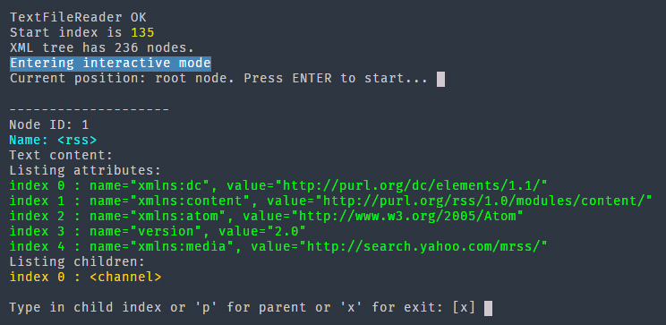

# TXP XML-Parser

### A fast and tiny XML parser.

This is a back-end project (command line).

Class "TextFileReader" makes use of Deno runtime (https://deno.land/) but could be easily rewritten to use NodeJS - using `fs.readFileSync`, see [here](https://nodejs.dev/learn/reading-files-with-nodejs). However headers of all .ts files would need small modifications too because NodeJS uses another module system than ES6 (Deno's module system is compatible with ES6).

The program contains an interactive mode which looks like this:

There is also a very basic query search (XPath) which collects node content into an array of strings.
See `index.ts` for examples. The output can then be processed individually, here is a screenshot of processing an RSS feed and showing only first 10 results:

### Why another XML parser?
- Back-end JavaScript does not offer DOMParser and/or XMLHttpRequest with its built-in XML parsers
- All existing XML parsers which I have found were either outdated (= don't even work) or they did not meet my requirements (they were too complex). All I wanted was a simple XML parser which would extract specific nodes in order to present the extracted content somewhere else.

### Current status:
- Works with most (well-formed) XML files (which means also RSS and Atom feeds)
- Supports XML attributes, namespaces, CDATA sections
- Does not support more advanced XML features (XML specification is _huge_)
- Big files should be no problem (very fast processing, tested with 21000 nodes)

### To do:
- XML files with comments currently don't work
- Export of query results to a CSV file would be nice but this can be done indirectly by using the `currentResults` property

If you should find any issues, just let me know - preferably through GitHub discussions (https://github.com/Amarok24/TXP-XML-Parser/discussions).

### License:
This project is released as permissive free software under the Apache License, Version 2.0 (http://www.apache.org/licenses/LICENSE-2.0)
